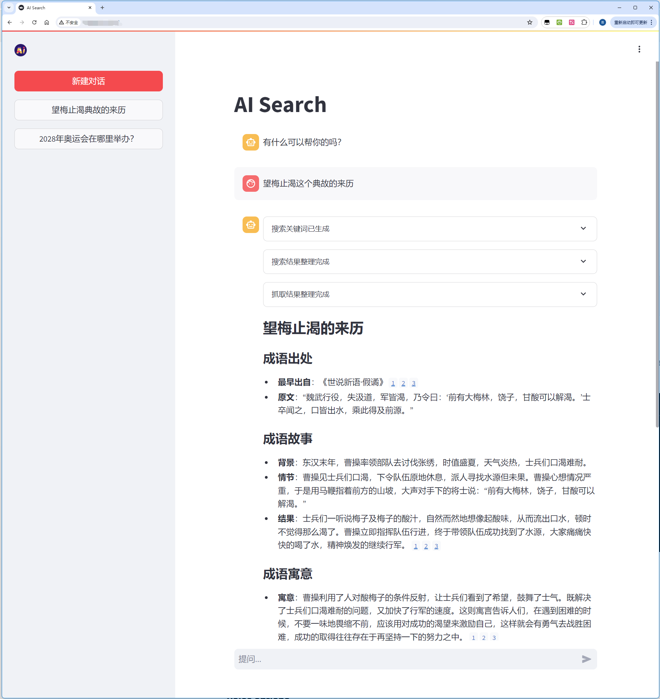

# 项目介绍
简单的AI搜索demo，连接LLM api，根据用户提问自动生成搜索词、搜索和爬取网络数据并总结输出。

# 设计目标
- 实现简单的联网搜索，减少附加功能，目的是为了提供最简单的demo
- 不依赖商业化的服务，尽量用开源和离线服务

# 实现细节
## 前端
- 使用Streamlit构建UI界面，配合streamlit_js_eval进行PC页面检测
## 后端
- 大模型：使用标准openAI api连接大语言模型服务（我自己用的是VLLM）
- 搜索引擎API：我自己搭建的searXNG服务（代码中有链接地址，不保证长期可用）
- 爬虫：使用requests和bs4进行简单的网页内容提取

# 运行效果

</img>

# 使用方法
```
conda create -n ai_search python=3.10
conda activate ai_search
pip install -r requirements.txt
```
> 记得修改```llm.py```中openai api的base url和api key，然后启动streamlit服务即可。
```
streamlit run chat_main.py --server.port 8080
```
> 注意：默认的searXNG服务地址可能需要科学上网才能访问，也可以选择自行搭建searXNG服务。

# 优化方向
- UI：streamlit只能提供最简单的UI，更高性能、更丰富的UI需要使用其他框架
- 搜索引擎API：当前使用的是searXNG，可以替换成其他搜索引擎API，如Google、Bing等，以获得更好的搜索结果
- 爬虫：当前使用的是requests和bs4，可以替换成其他爬虫框架如Scrapy、Selenium等，或者专门为AI优化的开源爬虫框架如[firecrawl](https://github.com/mendableai/firecrawl)、[crawl4ai](https://github.com/unclecode/crawl4ai)等，当然在线服务[jina reader](https://jina.ai/reader)也是不错的选择；网络爬虫本身就是一门很深的学问，现在网络信息十分分散，有文字、图表、视频等形式，也存在小红书、公众号等信息孤岛，可优化空间很大
- 大模型：当前使用的是openAI api，可以自行选择成熟商用大模型服务，如ChatGPT、智谱、claude等；自行搭建的开源大模型建议使用30B+参数的模型以获得更好的指令遵循效果、或者微调6~9B参数的模型以获得更好的效果（微调方案已放出，可[参考](./ft_script/ft_for_ai_search.md)）
- 对话服务：已经实现对话记录功能，但是每轮对话中多次提问并没有设计成多轮对话，因为网络爬取数据一般较长，多轮对话容易导致token溢出；多轮对话需要更多的精细化设计